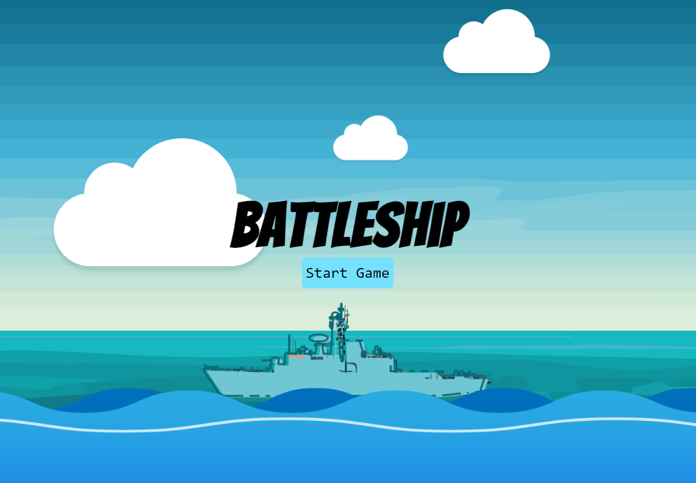
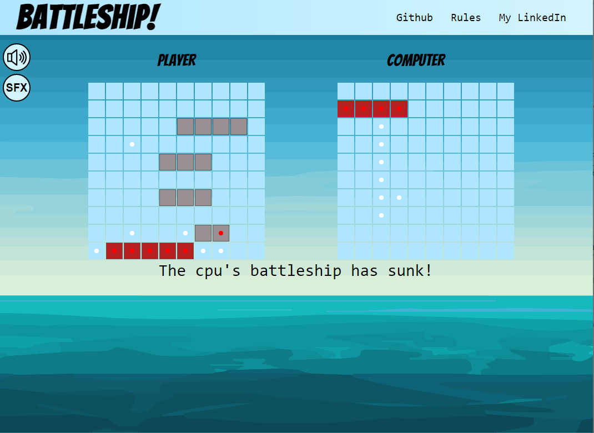

# Battleship!
---
## Intro

**Battleship!**  is a single player game where you fight on the open ocean to sink your opponents fleet of warships. Just make sure you sink theirs before they sink yours!
 

    
    

## Technologies Used
This project uses HTML, CSS, and JavaScript. 

## Getting Started
To play the game, [click here!](https://reidwids.github.io/Battleship/).

## Next Steps
- Implement a stronger guessing algorithm for the CPU. Ideally, it could keep track of the leads it gets and in the case where it hits multiple ships, it can keep track of all viable potential guesses. 

- Make the game mobile friendly.

- Style the ships to actually look like battleships.